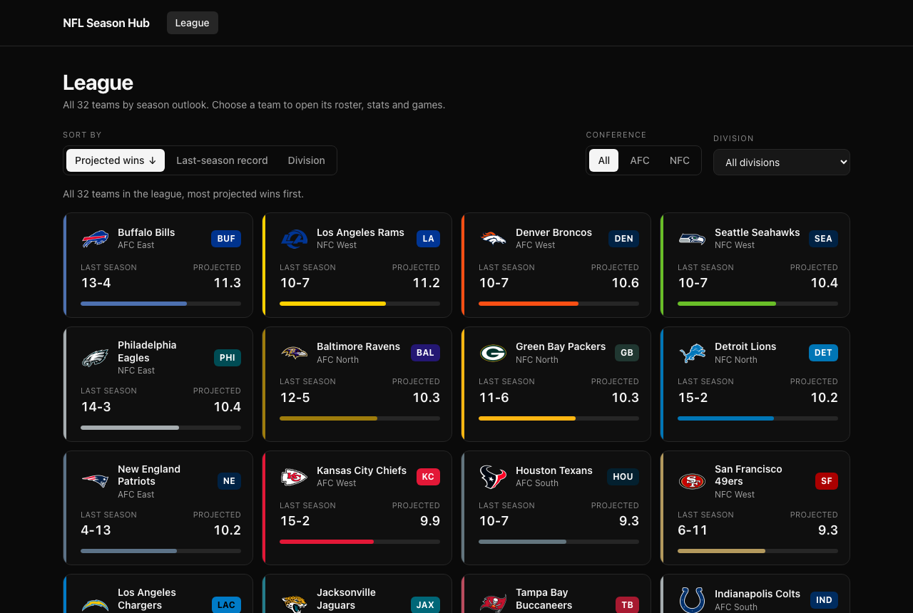
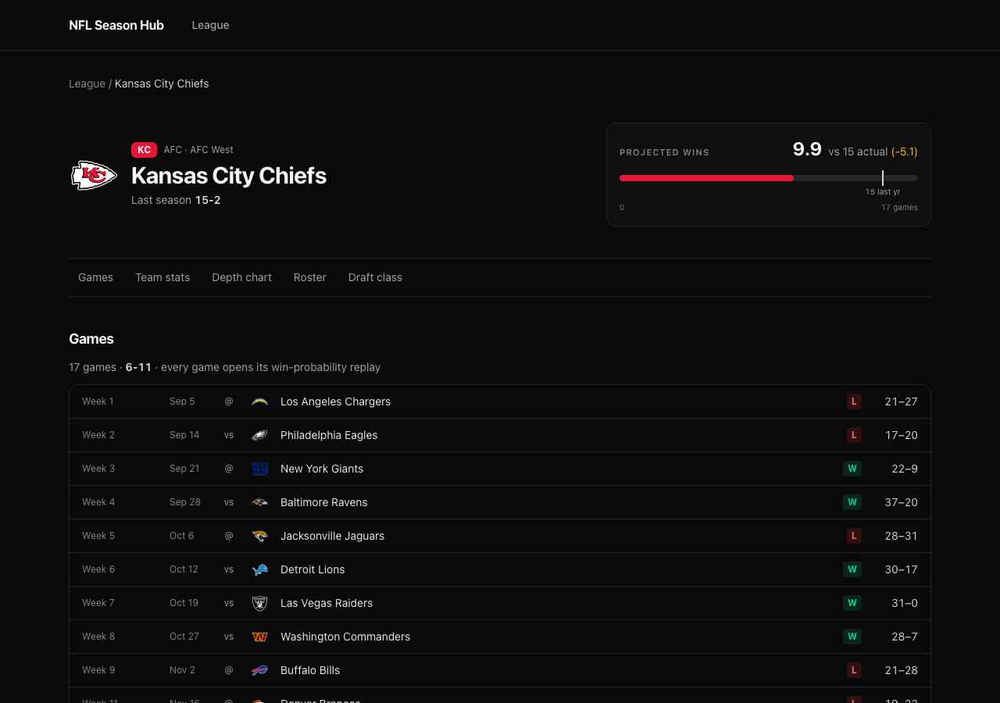

# NFL Season Hub

Six NFL seasons you can drill through — league standings, any team, any game — ending in a
scrubbable, animated replay of how that game's win probability actually moved.

**League → Team → Game → Replay.** 2020–2026. 1,694 games, 273,476 plays. No backend.

[](https://github.com/Rakesh0710/nfl-season-hub/actions/workflows/ci.yml)
[](https://nfl-season-hub.vercel.app)


---

## Problem

Play-by-play NFL data is public and excellent — nflverse publishes every play of every game since
1999, win probability included — and almost entirely unreadable. It arrives as season-sized parquet
files with hundreds of columns, which is wonderful for a modelling notebook and useless if the
question you actually have is _"what did that comeback look like?"_

The gap is not the data. It is that nothing turns a row of `home_wp = 0.11` into the thing a
person came for: the shape of a game.

## Product

A static site that takes a visitor from all 32 teams down to a single play in three clicks, and
then plays the game back to them.

- **League dashboard** — 32 teams sortable by projected wins, last-season record or division, and
  filterable by conference and division. The view lives in the URL, so a filtered dashboard is a
  link you can send someone.
- **Team page** — projected wins against last season's result, offensive and defensive splits,
  depth chart, roster and draft class, and every game that season as a route into its replay.
- **Game replay** — the flagship. The home team's win probability animates across the game one
  play at a time on an HTML canvas, with the plays the ETL flagged as decisive marked along the
  timeline, a scrubber to drag, and a context box that always says where the game stands.
- **Compare** — any two teams on one shared scale, offense and defense, with every game they have
  played since 2020 and the series record, each meeting linking to its replay.

## Demo

**[nfl-season-hub.vercel.app](https://nfl-season-hub.vercel.app)** — deployed from `main` on
every push. No backend, so there is nothing to wake up.

Try: [the league dashboard](https://nfl-season-hub.vercel.app/), a
[team page](https://nfl-season-hub.vercel.app/team/KC), the replay of
[the longest game in the dataset](https://nfl-season-hub.vercel.app/game/2022_15_IND_MIN) — 218
plays into overtime, Vikings 39, Colts 36 — or
[Chiefs against Bills](https://nfl-season-hub.vercel.app/compare?a=KC&b=BUF) side by side.

| League dashboard     | Team page          |
| -------------------- | ------------------ |
|  |  |


_(Screenshots are captured from the production build by Playwright; see
`docs/`. There is no recorded GIF of the replay — the animation is best seen by running it.)_

## Key features

- **60fps canvas replay** with play/pause, restart, 0.5×/1×/2×, a draggable scrubber and a
  key-play rail — all driven from a single fractional play cursor.
- **Every control reachable by keyboard**, including the 41-marker key-play rail, which is one
  tab stop with arrow-key navigation.
- **Contrast measured, not assumed** — team colours are lifted to WCAG thresholds against the
  surface they are actually drawn on, so all 32 clubs get a legible curve without losing their
  hue.
- **Runtime-validated data contract** — every JSON file is checked field by field before the app
  sees it, and a violation names the exact path that disagreed.
- **No backend, no database, no runtime data processing.** Static JSON on a CDN.

---

## Architecture

```
                    nflverse
   (play-by-play, rosters, depth charts, draft, schedules)
                        │
                        ▼
              Python ETL  (polars)
    etl/build_data.py — run once, locally, by hand
                        │
                        ▼
             Typed static JSON  ×1,729
  meta · teams-index · games-index · team/<ID> · game/<GAME_ID>
                        │
              etl/validate.py enforces the contract
                        │
                        ▼
          committed to public/data  (80 MB on disk, ~15 MiB packed in git)
                        │
                        ▼
             React 19 + TypeScript + Vite
   src/lib/data.ts  →  runtime contract check  →  typed values
                        │
                        ▼
              Canvas replay + requestAnimationFrame
                        │
                        ▼
                  Vercel (static)
```

_(The stage brief sketched this with pandas. The ETL is polars: `nflreadpy` returns polars frames
natively, so pandas would only add conversions in both directions. Nothing imports it.)_

The whole design follows from one decision: **the data never changes at runtime.** A finished
season is a fact. That removes the database, the API, the cache-invalidation problem and the
cold-start latency in one move, and replaces them with a build step someone runs when a new week
of football happens.

### Routing and data access

Four routes — `/`, `/team/:id`, `/game/:id`, `/compare` — inside one shared layout, each page a
lazy chunk, so a league visitor never downloads the replay engine and a comparison downloads
neither the replay engine nor the motion runtime.

All data access goes through [src/lib/data.ts](src/lib/data.ts). Components never call `fetch`,
never build a URL, and never see an untyped value. The cache stores the in-flight _promise_
rather than the resolved value, so two components asking for the same file share one request;
rejected entries are evicted so failures can be retried.

`useAsync(key, load)` returns a discriminated union, so a component cannot read `data` without
first proving the request succeeded. Loading is _derived_ from a stale key rather than stored,
which is also what stops a slow request for one team from painting over a fast one for the next.

### Deployment

`vercel.json` cannot carry comments — Vercel validates it with `additionalProperties: false`, so
even a `"comment"` key fails the build. The reasoning therefore lives here:

- **`"source": "/((?!data/).*)"`** — the SPA history fallback deliberately excludes `/data`.
  Without the exclusion a missing JSON file returns `index.html` with a 200 and the fetch layer
  reports a parse error instead of "not found". `vite preview` behaves exactly that way, which is
  why `src/lib/data.ts` _also_ rejects non-JSON content types; the two environments differ, so
  both guards are needed, and the end-to-end suite runs against `vite preview` for that reason.
- **`stale-while-revalidate`, not `immutable`** — game files are not content-hashed and do change
  when the ETL is re-run, so `immutable` would strand visitors on stale data. Game files get a day
  of freshness and a week of stale-serving; the small index files get an hour.
- **`"source": "/data/((?!game/).*)"`** — the second rule has to exclude what the first one
  matched. Vercel's `headers` are cumulative, not first-match-wins like `rewrites`: every matching
  rule is applied and the last one wins for a repeated key. Written as a plain `/data/(.*)`, the
  hour-long index rule silently overwrote the day-long game rule, and the header the deployed site
  actually returned for a 46 KB game file was the wrong one. This was invisible locally — `vite
preview` reads no `vercel.json` — and was only caught by curling the deployment.

---

## Data model

Five file shapes, mirrored exactly by [src/types/nfl.ts](src/types/nfl.ts):

| File                  | Count | Size (raw / gzip)    | Contents                                                     |
| --------------------- | ----: | -------------------- | ------------------------------------------------------------ |
| `meta.json`           |     1 | 0.4 KB               | when the data was generated, and how complete each season is |
| `teams-index.json`    |     1 | 8 KB / 1.4 KB        | 32 teams: identity, colours, last season, projection         |
| `games-index.json`    |     1 | 239 KB / 27 KB       | 1,694 games: ids, dates, scores, type (not yet fetched)      |
| `team/<ID>.json`      |    32 | ~23 KB               | roster, depth chart, draft class, splits, games              |
| `game/<GAME_ID>.json` | 1,694 | 45.9 KB / **6.8 KB** | every play: clock, score, down, description, win prob        |

A game averages 6.8 KB over the wire, which is why a replay can load on demand with no backend.

Counts here are from the last refresh and grow while a season is being played — `meta.json` is the
source of truth for what is actually shipped. The six completed seasons never change.

Two rules make the contract hold:

**Absent means absent.** An unknown value is _omitted_ from the JSON, never emitted as `null`.
`null` does not satisfy `number | undefined` under `strict`, so omission is the only
representation that typechecks — and it means "no down on this play" (a kickoff) never renders as
a placeholder pretending to be data.

**`isKeyPlay` is decided once, in the ETL.** A score, a turnover, or a win-probability swing of at
least ten points. The UI reads that flag and never applies a rule of its own, so the beads on the
curve and the markers on the timeline can never come to mean different things.

### Validation happens twice, from both sides

[`etl/validate.py`](etl/validate.py) checks all 1,729 generated files against the contract from
the producing side, and is itself verified by fault injection. It caught four real defects:
non-chronological `play_id`, timeout rows carrying stale scores, playoff games inflating
per-game rates, and a 2025 depth-chart schema change upstream.

[`src/lib/contract.ts`](src/lib/contract.ts) checks the same contract from the consuming side, at
runtime, in the browser. `response.json()` hands back an `unknown`, and the usual `as Game` turns
a stale deploy or a half-written ETL run into a crash somewhere far away from the fetch that
caused it. Instead every field is checked at the one place untrusted data enters the app, and a
failure reads:

```
/data/game/2023_12_NO_ATL.json does not match the data contract —
game.plays[0].homeWinProb: expected a finite number, received "0.5"
```

The parsers return the interfaces from `types/nfl.ts` **by annotation**, so adding a property to
the contract is a compile error until it is checked. Past that module the types are earned rather
than asserted, which is why no other file in the application needs a type assertion at all.

---

## Replay architecture

The replay is the reason the project exists, and it is the one place where the obvious React
approach is the wrong one.

**Why not React state.** The animation advances a cursor 60 times a second. Storing that cursor in
`useState` means a render, a reconciliation and a commit per frame — for a chart whose only actual
change is a few hundred pixels of line. That is a lot of machinery to move a dot.

**What it does instead.** The cursor is a `useRef`, a fractional play index. A `requestAnimationFrame`
loop advances it by elapsed time and repaints the canvas directly. One frame costs one canvas
repaint and nothing else.

**How React finds out.** The two facts a person can actually see — whether it is running, and which
play it is on — are published through `useSyncExternalStore`, which is React's supported way to
read state that lives outside React. It re-renders when the _value_ changes: once per play, not
once per frame. On a 218-play game at 1×, that is eight renders a second instead of sixty.

```
     rAF loop ──writes──▶  cursor (ref)  ──read by──▶  canvas repaint      60×/s
                                │                       scrubber thumb     60×/s
                                └──published via useSyncExternalStore──▶ React  8×/s
```

Some consequences worth naming, each of which was a bug first:

- **Position is derived from elapsed time, never from a frame count.** A dropped frame slows the
  replay by a frame's worth; it does not push it out of step with the clock.
- **A single frame may advance the cursor by at most 100ms.** `requestAnimationFrame` stops firing
  in a background tab, so the first frame after returning can carry minutes of wall time and would
  otherwise jump the replay to the final whistle.
- **The canvas is measured in a `ResizeObserver`, never inside a frame.** Reading
  `getBoundingClientRect()` during a frame forces a synchronous layout whenever anything has
  dirtied the DOM — which the scrubber does every frame by writing its own progress. Moving the
  measurement took forced layouts during playback from 60 a second to none.
- **The scrubber thumb is written imperatively**, from the same cursor, to a thousandth of the
  track. Sub-pixel writes are skipped — except across a play boundary, because a skipped write
  there once left the thumb reporting a different play from the readout beside it.
- **The drawing module is pure.** A context, a size and a cursor go in; pixels come out. Nothing in
  it reads the clock, React state, or the DOM. The same code renders the running animation, a
  paused frame, and any position a scrubber is dragged to — and it can be tested against a
  recording context with no browser at all.

---

## Technical decisions

**Static JSON over a backend or API.** The data is historical and immutable; there is nothing to
serve dynamically. The cost is a 15 MiB repository and a manual re-run when a new week lands. The
benefit is no server, no database, no cold start, no runtime failure mode more complex than a 404,
and a CDN that can cache everything. For a dataset that is finished, this is the right shape.

**Recharts first, then a custom canvas.** The win-probability chart was built in Recharts in an
earlier stage — deliberately, as a way to validate the data before investing in the flagship. It
did that job and was then deleted. A charting library was never going to give per-frame control of
a 218-point animated reveal, and shipping both would have cost the bundle twice. Validating first
and replacing second is cheaper than either guessing or building the hard thing twice.

**Local ETL over runtime processing.** Parsing 273,476 plays takes minutes; doing it per request
would be absurd, and doing it in a serverless function would reintroduce the backend the design
exists to avoid. The tradeoff is that data freshness is a human action.

**Imperative animation state over React state.** Covered above. The cost is that the replay's
cursor is not inspectable in React DevTools and cannot be driven by a React render; the benefit is
that the frame budget is spent on drawing.

**`useSyncExternalStore` over a mutable ref plus a forced re-render.** The loop genuinely _is_ an
external system on a different clock. Using React's own escape hatch for that keeps it correct
under concurrent rendering instead of relying on the render phase seeing a mutation it should not.

**Framer Motion, but only in the pages that animate.** It is 26 kB gzipped. Importing it into the
shared layout for one page-transition fade put it in front of every first visit, including game
pages that never used it — the entry chunk went from 84 kB to 110 kB. That transition is now nine
lines of CSS, and the motion runtime is confined to the League and Team chunks, loaded with
`LazyMotion` and the lightweight `m` components.

**oxlint over ESLint.** It is what `create-vite` scaffolds now; same role, considerably faster.

**`nflreadpy` over `nfl_data_py`.** The latter is deprecated upstream and pins `pandas<2`/`numpy<2`,
which have no Python 3.12 wheel — it will not install on a current interpreter.

**`projectedWins` is market-implied, not a Vegas over/under.** The nflverse win-totals dataset was
discontinued after 2020. Each game's closing spread is converted to a win probability and summed
across the regular season, which covers all six seasons instead of one. The dashboard says so.

**Team logos are requested at the size they are drawn.** nflverse stores ESPN's 500×500 master, 42
to 79 KB per club. The league dashboard drew 32 of them at 40px: measured at **1,789 KiB** of
image for one page. ESPN's own image combiner resizes on their CDN, so the app asks for twice the
CSS size and the same page now weighs **262 KiB**. Nothing is proxied or re-hosted, and a URL from
any other origin passes through untouched.

---

## Testing

```
274 unit and component tests   16 files   Vitest + React Testing Library
 16 end-to-end specs           ×2 devices  Playwright (desktop Chrome, Pixel 5)
```

The tests are aimed at behaviour that could plausibly break, not at a coverage number.

| Area                     | What is actually asserted                                                                                                                                                            |
| ------------------------ | ------------------------------------------------------------------------------------------------------------------------------------------------------------------------------------ |
| League sorting/filtering | every sort key and direction, the name tiebreak, immutability of the input, contradictory URL params                                                                                 |
| URL state                | round-trips, unknown values falling back, a division that contradicts its conference losing                                                                                          |
| Data layer               | 404 → not-found, HTML-with-a-200 → not-found, truncated JSON → malformed, contract violation → malformed                                                                             |
| Request cache            | concurrent callers share one fetch, failures are evicted and retryable                                                                                                               |
| Contract                 | the real generated files parse; each failure mode names its path; extra fields are tolerated                                                                                         |
| Replay control state     | seek-while-paused stays paused, seek-while-playing continues, Play rewinds a finished replay but resume does not, no two loops ever run, the frame handle is cancelled on unmount    |
| Frame pacing             | a 120-second frame (a backgrounded tab) advances 0.8 of a play, not the whole game                                                                                                   |
| Canvas drawing           | `indexAtOffset` inverts `xForIndex` for every play at three widths; beads appear only once passed; a non-finite cursor still draws                                                   |
| Colour                   | all 32 real team colours clear 3:1 on the card and on the bar track, and AA as badge text                                                                                            |
| Comparison               | the leader is inverted for defensive metrics, an exact tie names no one, meetings are symmetric in their arguments and never include a third team, and the two series records mirror |
| Components               | loading, error, retry, empty and not-found states; keyboard operation of the whole transport                                                                                         |

Two examples of tests that exist because the bug happened:

```ts
it('keeps Restart enabled, so pressing it never drops focus to the body', ...)
it('never reports a different play from the readout beside it', ...)
```

The end-to-end suite drives the production build served by `vite preview`, clicking from the
league dashboard through to a replay, dragging the scrubber, selecting a key play and operating
the transport with the keyboard alone. One test clicks a key-play marker **as a pixel rather than
as an element**: markers cluster, so on a phone a neighbour's 24px hit box covers the target and
Playwright's actionability check refuses the click, while a real finger lands there anyway. The
rail resolves clicks to the nearest marker for exactly that reason, and that is what the test is
for.

### CI

[`.github/workflows/ci.yml`](.github/workflows/ci.yml) runs on every push and pull request:

| Job      | Steps                                                                                     |
| -------- | ----------------------------------------------------------------------------------------- |
| `verify` | `npm ci` → typecheck → lint → format check → 274 tests → production build → bundle report |
| `data`   | `etl/validate.py` against the committed JSON (stdlib only; no ETL run needed)             |
| `e2e`    | Playwright against the built app, report uploaded as an artifact                          |

---

## Performance

Everything below is measured, not estimated. Lighthouse 13.4.1 against **the deployed site**,
headless Chrome, desktop preset and the default mobile preset (4× CPU throttling, simulated slow
4G). Machine benchmark index 3057. Lighthouse is not a dependency of this project — it is run
with `npx` when a measurement is wanted, so nobody pays 21 MB of install for a number.

| Page    | Form    | Perf | A11y | Best practices | SEO | FCP   | LCP   | TBT   | CLS   | Page weight |
| ------- | ------- | ---: | ---: | -------------: | --: | ----- | ----- | ----- | ----- | ----------: |
| League  | desktop |  100 |  100 |            100 | 100 | 0.3 s | 0.4 s | 0 ms  | 0.046 |     265 KiB |
| Team    | desktop |   99 |  100 |            100 | 100 | 0.4 s | 0.5 s | 0 ms  | 0.069 |     171 KiB |
| Game    | desktop |  100 |  100 |            100 | 100 | 0.3 s | 0.3 s | 0 ms  | 0.005 |     124 KiB |
| League  | mobile  |  100 |  100 |            100 | 100 | 1.2 s | 1.4 s | 0 ms  | 0     |     222 KiB |
| Team    | mobile  |  100 |  100 |            100 | 100 | 1.3 s | 1.7 s | 20 ms | 0     |     171 KiB |
| Game    | mobile  |  100 |  100 |            100 | 100 | 1.2 s | 1.2 s | 0 ms  | 0.033 |     124 KiB |
| Compare | desktop |  100 |  100 |            100 | 100 | 0.4 s | 0.4 s | 0 ms  | 0     |     150 KiB |
| Compare | mobile  |   96 |  100 |            100 | 100 | 1.4 s | 2.3 s | 0 ms  | 0     |     150 KiB |

A loaded comparison is the slowest route on mobile — 96, LCP 2.3 s — because it is the only page
that fetches the 27 KiB game index, and it does so to show six seasons of head-to-head rather than
the two meetings a team file could supply. That is the trade named when the feature was scoped,
and it is worth it. Its layout shift is 0, the best in the app, because its skeleton is sized from
the real thing rather than sketched.

The same build measured on `vite preview` over localhost scores one to two points lower on mobile
(FCP 1.6 s rather than 1.2 s): the CDN's brotli and HTTP/2 are doing real work, and a local
preview is the pessimistic reading rather than the flattering one. These are single runs — across
repeats the scores moved by at most one point and LCP by up to 0.3 s. Reproduce either with:

```bash
npx lighthouse https://nfl-season-hub.vercel.app/ --preset=desktop --view
npm run build && npm run preview -- --port 4173   # then point it at localhost:4173
```

### Frame rate

240 consecutive frames during playback of the longest game in the dataset (2022 week 15,
IND at MIN, 218 plays, overtime), in the production build:

```
median frame  16.70 ms      p95  16.70 ms      worst  16.80 ms
frames over 33 ms (a dropped frame): 0 / 239
long tasks (>50 ms) during 3 s of playback: 0
```

That is the 60 Hz budget, held. Profiled separately, all canvas drawing costs **0.14 ms per
frame** and the axis labels **0.03 ms** of a 16.7 ms budget — which is why the obvious
optimisation of caching the static background to an offscreen bitmap was measured, found to cost
more in blitting than it saved, and not done.

### Bundle

```
index               267.36 kB   84.78 kB gzip   React, React Router, the shell — every page
features-animation   73.87 kB   25.80 kB gzip   Framer Motion — League and Team only
CSS                  30.73 kB    6.51 kB gzip
GamePage             17.85 kB    6.29 kB gzip   the replay engine — only on a game page
TeamPage             16.48 kB    4.71 kB gzip
ComparePage          10.61 kB    3.51 kB gzip
LeaguePage            7.66 kB    2.70 kB gzip
useAsync              7.38 kB    2.98 kB gzip   data layer + runtime contract
football              2.53 kB    1.25 kB gzip
league                2.41 kB    0.95 kB gzip
stats, motion hook    0.85 kB    0.53 kB gzip
```

**Lazy loading, verified from the network log rather than from the config.** Measured per route,
gzipped:

| Route       | JavaScript |    Data | Motion runtime |
| ----------- | ---------: | ------: | -------------- |
| `/`         |  113.5 KiB | 1.4 KiB | yes            |
| `/team/:id` |  116.9 KiB | 5.5 KiB | yes            |
| `/compare`  |   90.5 KiB | 1.4 KiB | **no**         |
| `/game/:id` |   92.3 KiB | 6.6 KiB | **no**         |

A loaded comparison adds 35 KiB of data on top — two team files and the 27 KiB game index — and
`GamePage` appears on no other route's list. The replay engine is downloaded when, and only when, someone
opens a game.

**What the runtime contract costs.** Validating the largest file the app loads — the 239 KB,
1,694-game index — takes **0.23 ms**, against the **0.57 ms** `JSON.parse` spends on the same
file. It adds **1.17 kB gzipped** to the shared data chunk (1.85 → 3.02 kB), measured by building
the previous commit and diffing. Because validation is that cheap, the cache stores the unchecked
JSON and re-validates on each read, rather than storing a typed value the cache would have to
assert the type of.

### What is left on the table, and why

- **`unused-javascript`, 36 KiB.** React and Router code not executed during first paint. Real,
  but not separable without shipping a different framework.
- **CLS 0.069 on the team page.** The only element that moves is the footer: while the skeleton is
  showing, the page is exactly one viewport tall, so the footer is on screen; when 5,542px of team
  page arrives, it moves below the fold. Both figures are inside Google's "good" threshold (<0.1),
  and closing the gap would mean the skeleton knowing the size of the data it is waiting for.
  Padding the skeleton until the footer starts off-screen would improve the metric and not the
  experience.
- **Third-party cache headers, ~48 KiB.** The logos are served by ESPN's CDN with their cache
  policy, not ours.

---

## Accessibility

The audit was run with the keyboard only, and the numbers came from the rendered page rather than
from reading the CSS. Lighthouse scores accessibility **100 on all three pages**, on both form
factors — but Lighthouse's automated checks are a floor, not the audit. The rest of this was found
by hand:

- **Every control is reachable and every stop is visible.** League 44 tab stops, Team 30, and the
  replay fully operable at 320px. Focus escapes every page; there are no traps.
- **The key-play rail is one tab stop.** A game carries up to 41 markers; forty-one stops between
  the scrubber and the Play button would be a wall. Roving tabindex with arrow, Home and End keys.
- **Text contrast is measured against the composited background.** Tailwind v4 serialises colours
  as `oklch()`, so each colour is painted into a canvas and read back rather than parsed — a regex
  produced 60+ false failures before that. Two real failures were found and fixed
  (`text-neutral-600` at 2.46:1, `text-neutral-500` at 4.05:1); all 88 distinct text styles across
  four pages now clear 4.5:1.
- **Graphics that carry meaning clear 3:1.** The replay curve against the card, and every bar fill
  against its track — enforced by a test that reads the real team index, because nine and twelve
  clubs respectively failed before it existed.
- **`prefers-reduced-motion` is honoured everywhere**, including the skeleton pulse and the
  count-ups. With reduced motion the replay renders the finished curve immediately, with the
  transport still there if you want to watch it play.
- **Native semantics are not re-labelled.** Buttons are buttons, the scrubber is an
  `<input type="range">` with an `aria-valuetext` that says "Play 42 of 218, Q3 6:12, NO 17, ATL
  24, ATL 71 percent" rather than "42". ARIA appears only where there is no native equivalent.
- **Restart is never disabled.** Disabling it on reaching play 0 — which pressing it does — moved
  focus to `BODY`, so a keyboard user lost their place the moment the button worked.

---

## Running locally

```bash
npm install
npm run dev            # http://localhost:5173

npm run typecheck      # tsc -b, four projects: app, node, tests, e2e
npm run lint           # oxlint
npm run format         # prettier --write .
npm test               # Vitest, 274 tests
npm run test:coverage  # with a v8 coverage report
npm run e2e            # Playwright (builds and serves the app itself)
npm run build          # typecheck + production build
npm run verify         # everything CI runs, in order
```

Playwright needs its browser once: `npx playwright install chromium`.

Refreshing the data is a separate, Python-side job — see
[Keeping the data current](#keeping-the-data-current).

The generated data is committed, so nothing above needs Python or a network round trip to
nflverse.

## Keeping the data current

The data is static, and a finished game never changes — but a season in
progress does. The update path keeps the static deployment and adds a schedule
to it: **scheduled ETL → regenerated JSON → pull request → deploy**. No server,
no database, no runtime fetch of anything but committed files.

```
Tuesday 09:00 UTC (or a manual run)
        │
        ▼
  python etl/build_data.py --refresh        rebuild the newest season only
        │
        ▼
  python etl/validate.py                    fail closed on a contract breach
  python etl/test_refresh.py                fault-inject the guardrails
  npm test && npm run build                 the app can still read it
        │
        ▼
  pull request with the diff                ← the one human step
        │
        ▼
  merge → Vercel deploys
```

### Only the newest season is rebuilt

A full build re-derives six seasons and rewrites 1,727 files. A refresh rebuilds
the newest season and **merges** it into the committed index, so finished
seasons come out byte-identical. Run against the live 2026 season it touched
three files:

```
Refresh: rebuilding 2026 only, merging into 1693 indexed games
  2025: 285/285 played, complete  <- team layer
  2026: 2/272 played, IN PROGRESS
Done. 32 teams, 1694 games, 1.0 MB total
```

`merge_index` will not let a refresh delete history. A game in the old index
that the rebuild no longer produces aborts the run rather than disappearing —
nflverse withdrawing a game, or a half-finished download, would otherwise
silently remove replays that team pages still link to.

### Which season the figures describe is a rule, not a judgement call

The team layer — rosters, stat lines, projections — describes exactly one
season. Pointing it at a season two games old does not degrade gracefully. On
11 September 2026, with two games played, it would have produced this:

```
teams with a 2026 record: 4 of 32     the other 28 dropped from the dashboard
LA 0-1  projectedWins 0.60            next to a lastSeason record of 11-6
```

So `PROMOTE_MIN_PLAYED` (64 games, roughly four weeks) decides. Until a new
season clears it, the team layer stays on the last complete one and the site
says a newer season is under way. `--display-season` overrides by hand, and a
separate guard refuses to publish a dashboard missing teams whatever the flag
says.

### Nothing is presented as something it is not

`meta.json` — a new file, no established contract touched — records when the
data was generated and how far through each season it is:

```json
{
  "generatedAt": "2026-09-11T05:54:49Z",
  "displaySeason": 2025,
  "latestSeason": 2026,
  "seasons": [{ "season": 2026, "scheduled": 272, "played": 2, "complete": false }]
}
```

Three things read it:

- **Every footer**: `Refreshed 4 minutes ago — 2026-09-11. Seasons 2020–2026.`
  The wording is deliberately coarse; the exact instant is on the `<time>`
  element. It is lazily loaded with no fallback, so a missing `meta.json`
  removes the line and nothing else.
- **The league page**, above the controls rather than in a footnote, because it
  changes how every number below it should be read: _"Figures describe the
  complete 2025 season. The 2026 season is under way, 2 of 272 games played; it
  takes over here once enough of it has been played to describe."_ It appears
  only when there is a distinction to explain.
- **Team stat panels**: "From 1,048 regular-season scrimmage plays in 2025."
  These are season-shaped figures and a reader who assumes they are this week's
  is reading them wrong.

If `--display-season` is used to force an unfinished season, the notice changes
to say so outright — "2026 so far, 2 of 272 games played, so they are a partial
season and not comparable with a finished one" — rather than letting partial
and complete figures sit side by side unlabelled.

### Why a pull request and not a push

The data is the product; a bad refresh is a bad deploy. Everything up to the PR
is automatic and fails closed — an invalid file, a dropped game, or an app that
can no longer parse its own data all stop the run. The diff is the review: a
handful of changed files is a normal week, and a larger one is a question worth
answering first. A run that changes nothing opens no PR, because a weekly "no
change" PR trains people to merge without looking.

### Running it by hand

```bash
python etl/build_data.py --refresh                  # newest season, merged
python etl/build_data.py --refresh --display-season 2026   # force the team layer
python etl/validate.py --data public/data
python etl/test_refresh.py
```

### What this does not do yet

Unplayed fixtures are not published. The ETL emits games that have both a
result and play-by-play, so a schedule of upcoming games does not exist in the
JSON — `GameSummary.homeScore` is a required number, and an unplayed game has
no score to put there. That work becomes necessary exactly when the promotion
rule fires and the displayed season is one still being played, and it is a
contract change (optional scores, so absent keeps meaning absent) rather than a
new file. Until then there are no future fixtures in the displayed season to
show.

## ETL instructions

Only needed to regenerate or extend the dataset.

```bash
cd etl
python3 -m venv .venv && source .venv/bin/activate
pip install -r requirements.txt      # nflreadpy, polars, pyarrow — pinned exactly

python build_data.py                 # writes ../public/data (80 MB, a few minutes)
python validate.py --data ../public/data
```

`requirements.txt` pins exact versions on purpose: `nflreadpy` is pre-1.0 and its loaders have
already changed shape once (the 2025 depth-chart schema), so a floating range would make the
pipeline silently non-reproducible.

[etl/README.md](etl/README.md) documents the key-play rule, the missing-data decisions, and the
dataset quirks worth knowing before trusting a number.

## Attribution

Data from **[nflverse](https://github.com/nflverse)**, used under
**[CC BY 4.0](https://creativecommons.org/licenses/by/4.0/)**. nflverse data is itself derived
from NFL play-by-play sources; the win-probability model is nflfastR's.

Team logos are served from ESPN's CDN, the URLs supplied by the nflverse teams dataset.

This project is not affiliated with, endorsed by, or connected to the National Football League or
any of its clubs. Team names, logos and colours are the property of their respective owners and
appear here for identification only.

## What I'd build next

- **Compare two games, or two seasons, on one axis.** The chart already draws from a pure series;
  a second series is mostly a legend and a colour decision.
- **A drive-level layer over the play-level one.** The ETL already knows possession and scoring;
  grouping plays into drives would let the replay skip forward a drive at a time, which is closer
  to how people actually talk about a game.
- **Search across all 1,694 games** — by team, week, margin, or "games that swung more than 60
  points". `games-index.json` already exists, is validated, and has a typed accessor; no page
  loads it yet, because a team's own games travel inside its team file. At 27 KB gzipped this is
  a filter over one fetch, not a backend.
- **Precompute the replay's per-play deltas in the ETL** so the client stops recomputing the
  chart series on every mount. Currently 0.05 ms for a typical game, so this is a correctness-of-
  ownership argument rather than a performance one.
- **A shareable deep link into a moment** — `/game/<id>?play=142` — which the replay's single
  cursor already makes almost free.
- **Visual regression tests on the canvas.** The drawing code is pure and deterministic, so a
  pixel snapshot per game archetype would catch what a recording context cannot.
